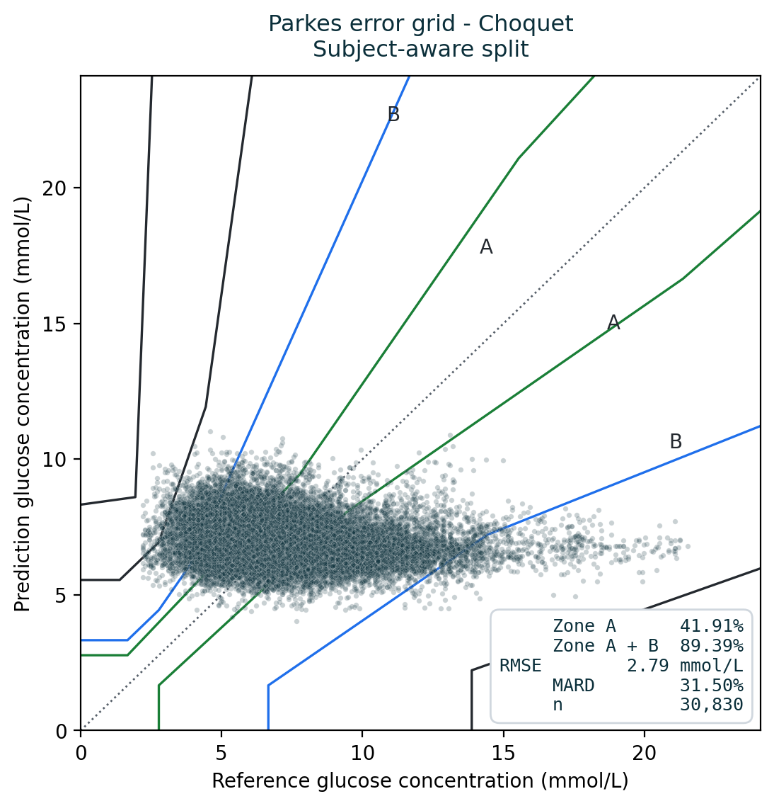

# Noninvasive blood glucose estimation from ECG and PPG

A from-scratch reproduction of:

> J. Li et al., *"Noninvasive Blood Glucose Monitoring Using Spatiotemporal ECG and PPG
> Feature Fusion and Weight-Based Choquet Integral Multimodel Approach,"*
> IEEE Transactions on Neural Networks and Learning Systems, 35(10), 2024.

Run on **PhysioCGM** (10 Type-1 diabetes patients, ECG + PPG + CGM, CC0) instead of the
authors' private data — **30,830 paired windows, 193 features**.

**📄 [Read the full write-up →](WRITEUP.md)** — the problem, every formula derived, what
we built, what we found, and what we cannot claim. Written to be readable without a
background in ML or signal processing.

---

## The short version

The paper reports **1.49 mmol/L RMSE** by extracting features from ECG and PPG, then
fusing three models with a Choquet integral. We rebuilt all three of its stages and
evaluated them honestly.

**It does not hold up on this data** — and the interesting part is *why*. We found four
distinct ways this kind of pipeline produces confident numbers that are wrong while
appearing to work:

| # | Finding | Evidence |
|---|---|---|
| **1** | **The evaluation protocol dominates the model** | R² **+0.149** under a random split, **−0.223** and **−0.097** under the two honest ones — identical data and code |
| **2** | **Clinical metrics mask the failure** | A constant predictor scores the **best** Parkes Zone A+B (90.0%) *and* the best R² of anything tested |
| **3** | **The fusion degenerates into a minimum operator** | `corr(Choquet output, min of the models) = 0.998` |
| **4** | **A standard feature library is non-deterministic** | `nolds.corr_dim` defaults to an unseeded random fit; up to **72%** of values change between identical runs |

Plus two silent data hazards caught by guards written to refuse rather than guess: the two
recorders do not share a clock, and one patient's recording crosses a daylight-saving
transition.

### The degeneracy theorem

When every model's density estimate saturates at the same value `g`, the Sugeno λ-measure
becomes symmetric and the Choquet integral provably reduces to a fixed order statistic:

```
w_j = g · β^(j−1),    β = 1 + λg,    j = 1 is the LARGEST prediction
```

Since `Σ gᵢ < 1 ⟹ λ > 0 ⟹ β > 1`, weight piles onto the **smallest** prediction. At the
observed floor `g = 0.01`, **89.5%** of the weight lands on the minimum — so the
"multimodel fusion" was returning `min(m1, m2, m3)`.

The *symmetric measure ⟹ OWA* equivalence is standard aggregation theory (Grabisch;
Marichal). What is new here is identifying it as a **practical failure mode** of
performance-based density estimation, with a closed-form diagnostic, demonstrated in a
published biomedical pipeline.

Full derivation in [WRITEUP.md §9.3](WRITEUP.md#93-the-fusion-degenerates-into-a-minimum-operator).

---

## Results

Fused feature set (all 193), 30,830 windows, 10 patients.

| | Random window | Subject-aware | Leave-one-subject-out |
|---|---|---|---|
| Best single model (R²) | +0.194 | −0.243 | −0.092 |
| **Choquet fusion (R²)** | **+0.149** | **−0.223** | **−0.097** |
| No-skill baseline (R²) | −0.000 | −0.074 | −0.035 |
| Choquet RMSE (mmol/L) | 2.324 | 2.786 | 2.639 |
| Baseline RMSE (mmol/L) | 2.520 | 2.610 | 2.564 |
| **Beats the baseline?** | **yes** | **no** | **no** |

Under **either** honest split, every method — including the fusion — falls behind a model
that predicts a constant.

*(Leave-one-subject-out is not worse than subject-aware despite being stricter: it trains
on 9 of 10 patients per fold rather than 4 of 5, so it has more data. The baseline moves
the same way. The claim is not that results degrade monotonically with strictness — it is
that both honest protocols put every method behind the baseline.)*



The predictions form a **horizontal band** around 6–9 mmol/L regardless of whether the
true value was 4 or 20. That is what "no better than the average" looks like — and it
still lands 89.4% inside the clinically acceptable zones, which is precisely why the zone
metric cannot certify a model on its own.

---

## Layout

| Path | Contents |
|---|---|
| `bgfusion/stage1_data.py` | Loading, clock/timezone alignment, filtering, windowing |
| `bgfusion/features_temporal.py` | db4 DWT + the paper's 10 temporal features |
| `bgfusion/stage2_morphological.py` | QT, QTc, ST level, T-wave shape, HRV, PPG pulse morphology |
| `bgfusion/stage2_fusion.py` | Feature sets + UFS ∩ RFE ∩ L1 selection |
| `bgfusion/choquet.py` | Sugeno-λ solver + Choquet integral |
| `bgfusion/stage3_fusion.py` | The three models, densities, `degeneracy_report` |
| `bgfusion/evaluate.py` | Three split protocols, two controls, grading |
| `bgfusion/error_grid.py` | Parkes error grid zones |
| `deck/` | Generator for `BTP_presentation.pptx` |
| `legacy_d1namo/` | An earlier ECG-only study on D1NAMO (archived) |

Three things deliberately built to **fail loudly rather than guess**:

1. `detect_timezone()` raises when no candidate zone wins decisively
2. `select_features()` takes training data only — there is no whole-dataset variant
3. `degeneracy_report()` flags every fold where the fusion stops discriminating

---

## Running it

```bash
pip install -r requirements.txt

# Stage 1: extract 193 features per window for all 10 subjects (~2.5 h, resumable)
python run_stage1.py

# Stages 2+3: leakage-controlled evaluation (~15 min per configuration)
python run_evaluation.py

# Figures
python -m bgfusion.figures_theory      # the degeneracy result (no data needed)
python -m bgfusion.figures_results     # Parkes grid, time series, protocol comparison

# Rebuild the slide deck
node deck/main12.js
```

**Performance note.** Always launch extraction through `run_stage1.py`. It pins BLAS to
one thread per worker *before* numpy is imported — without that, each joblib worker spawns
its own full-size thread pool and the run goes **slower than single-threaded** (measured:
5.16 s/window unpinned vs 1.22 s/window pinned, a 4.2× difference).

---

## Data

Not included in this repository (8.6 GB). Download from figshare record **28136294**:

> *PhysioCGM: a multimodal physiological dataset for non-invasive blood glucose
> estimation.* Scientific Data, 2025. **CC0** (public domain).

The IEEE paper itself is **not** redistributed here — it is copyrighted. Obtain it from
IEEE Xplore.

---

## Limitations

- The morphological branch uses hand-crafted physiological features, **not** the paper's
  ResNet. Defensible and more interpretable, but not a bit-exact replication.
- Ten patients is small, even though PhysioCGM is the largest open ECG+PPG+CGM dataset.
- The CGM reference itself lags blood glucose by 5–15 min and carries ~9–10% error.
- **We cannot conclude the method never works** — only that it does not work on this
  dataset under honest evaluation, and that its fusion component was inactive.

---

*B.Tech Final Year Project — Navtesh Maken*
